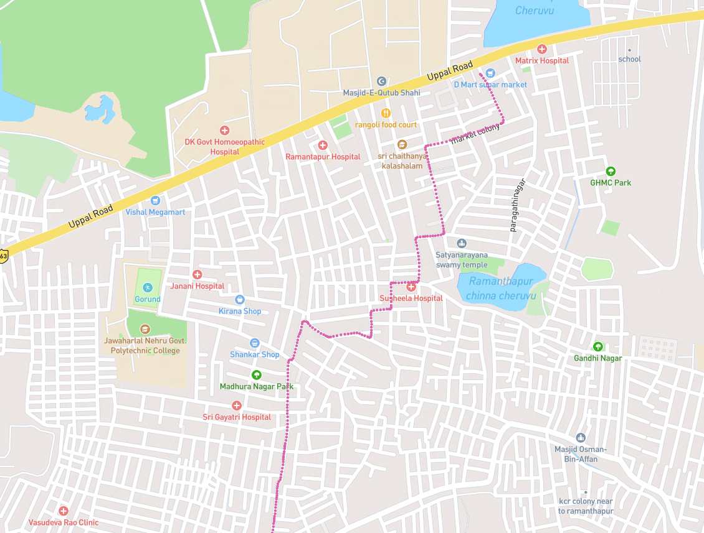

# Coding task for Potters Map internship

## GPS track display

Your task is to write a web appication using React and Typescript to display the given gps tacks on the map. A sample screen shot of the gps track is given below.

  

The tracks data is given in the `data/tracks.json` file. Each element in the array has following fields
- track_id : Unique id of the track
- start_timestamp : Track start time
- end_timestamp : Track end time

The `data/track_detail.json` file has an array of track details objects. Each element has the following fields.
- track_id : Unique track id from `data/tracks.json`
- tracks: Array of track points
  
  Each track point has folowing fields
  - timestamp : Time when the point was recorded
  - latitude : Latitude of the gps point
  - longitude : Longitutde of the gps point
- kms: Total kms in the track

### Page structure
- Use the basic layout from the https://leafletjs.com/
- Display a hamburger menu on top left like below screenshot

- On clicking in the menu, open a modal with option to select the gps track. The track_ids from the `data/tracks.json` should be displayed as the dropdown options. Sample screenshot is attached below

- On selecting the track, all the track points for that particular track id should be displayed on the leafletjs map.

### Specifications for rendering tracks on map

- Use the pink color for gps points.
- Connect each gps point using a line.
- Mark the starting point with green color marker.
- Mark the ending point with blue color marker.
- Each gps point should be clickable. A small popup should be opened on click of the same point. It should display the point index in the tracks and its timestamp. A sample screenshot is given below.

## Submitting the assignment

Entire executable code should be submitted as zipped archive uploaded to google drive. The submitted code should have instructions to run the code. The code should be readable and well tested.
